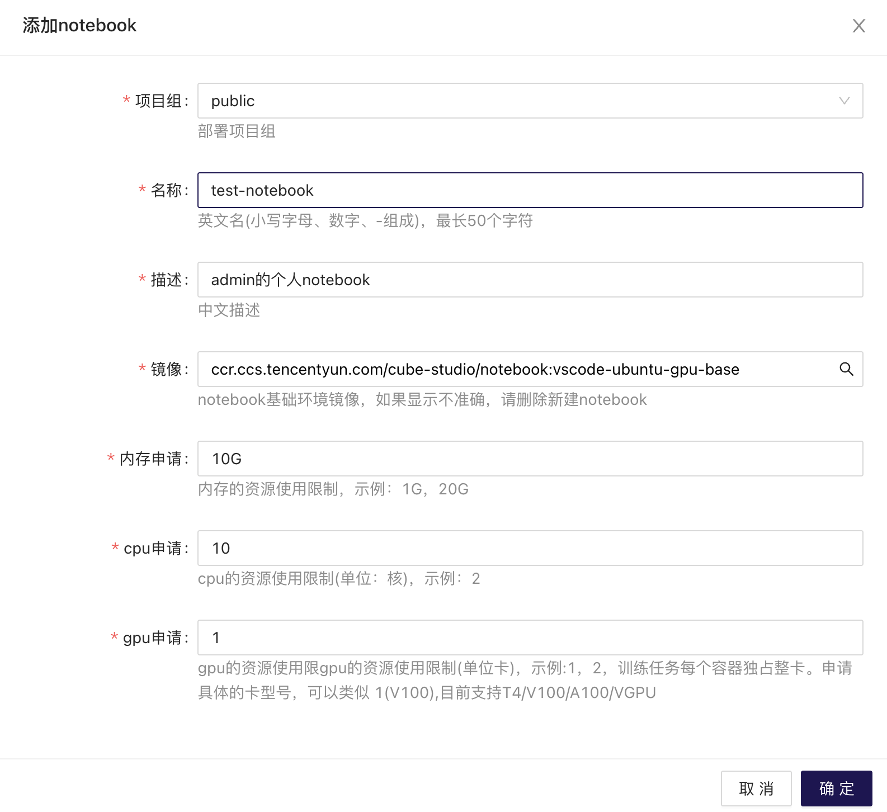

# VSCode示例

## 申请步骤
1. 找到在线开发界面，点击添加notebook

2. 申请资源，点击确定


3. 当状态为Running时代表VSCode已创建成功可以进行开发

## 使用技巧

1. 该开发环境会自动挂载/mnt/$(username)和/archives/$(username)目录，可以将/mnt/$(username)当作个人workspace使用，把需要持久化的内容放入/archive/$(username)目录保存。
   
2. 在Terminal中输入 `nvidia-smi`或`nvcc -V`查看GPU及驱动。
   ```shell
   root@test-notebook:/mnt/admin# nvidia-smi
Mon Oct 10 10:15:50 2022       
+-----------------------------------------------------------------------------+
| NVIDIA-SMI 460.91.03    Driver Version: 460.91.03    CUDA Version: 11.2     |
|-------------------------------+----------------------+----------------------+
| GPU  Name        Persistence-M| Bus-Id        Disp.A | Volatile Uncorr. ECC |
| Fan  Temp  Perf  Pwr:Usage/Cap|         Memory-Usage | GPU-Util  Compute M. |
|                               |                      |               MIG M. |
|===============================+======================+======================|
|   0  Tesla T4            On   | 00000000:00:07.0 Off |                    0 |
| N/A   25C    P8     9W /  70W |      0MiB / 15109MiB |      0%      Default |
|                               |                      |                  N/A |
+-------------------------------+----------------------+----------------------+                                                                        
+-----------------------------------------------------------------------------+
| Processes:                                                                  |
|  GPU   GI   CI        PID   Type   Process name                  GPU Memory |
|        ID   ID                                                   Usage      |
|=============================================================================|
|  No running processes found                                                 |
+-----------------------------------------------------------------------------+
root@test-notebook:/mnt/admin# nvcc -V
nvcc: NVIDIA (R) Cuda compiler driver
Copyright (c) 2005-2019 NVIDIA Corporation
Built on Sun_Jul_28_19:07:16_PDT_2019
Cuda compilation tools, release 10.1, V10.1.243
   ```